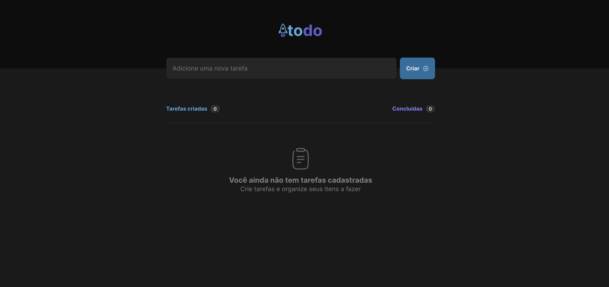

# Todo List - Ignite Challenge

Este projeto é um desafio do curso Ignite da Rocketseat. O objetivo é criar uma simples lista de tarefas (todo list) utilizando React e TypeScript.

## Sobre o Projeto

O projeto é uma aplicação simples de lista de tarefas, onde o usuário pode adicionar novas tarefas, marcar tarefas como concluídas e excluir tarefas. A aplicação foi desenvolvida utilizando React para a interface do usuário e TypeScript para tipagem estática.

## Tecnologias Utilizadas

- React
- TypeScript
- CSS Modules

## Como Executar o Projeto

Primeiro, instale as dependências do projeto executando o seguinte comando no terminal:

```bash
npm install
```

Em seguida, execute o projeto com o seguinte comando:

```bash
npm run dev
```

Agora, abra o navegador e navegue até ```http://localhost:3000/``` para ver a aplicação em execução.

## Estrutura do Projeto
O projeto segue a estrutura padrão de um projeto React com Typescript:
- [src](./src/): pasta onde se encontra o código fonte da aplicação
  - [components](./src/components/): Este diretório contém todos os componentes React utilizados na aplicação.
  - [App.tsx](./src/App.tsx): Este é o componente principal da aplicação.
  - [main.tsx](./src/main.tsx): Este é o ponto de entrada da aplicação.
- [public](./public/): Este diretório contém os arquivos públicos da aplicação.
- [package.json](./package.json): Arquivo de configuração do NPM.
- [tsconfig.json](./tsconfig.json): Arquivo de configuração do TypeScript.